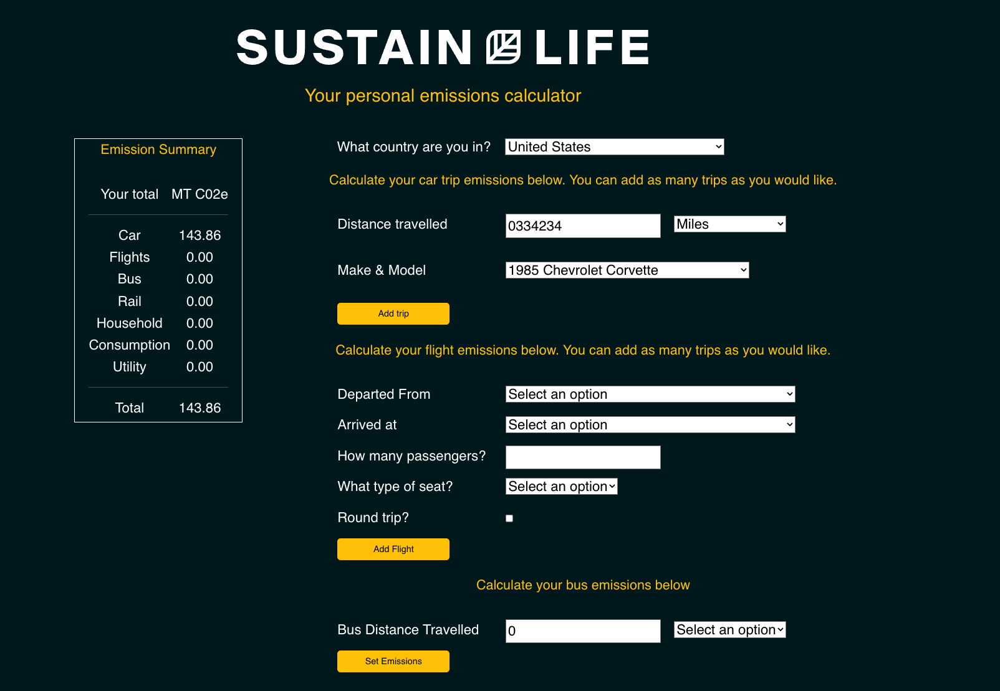

# Sustain.Life – Personal Emissions Calculator API ReactJS Quickstart

This quickstart is a guide on how to interact with our API from a ReactJS frontend.


## Features

- Calculates personal carbon emissions based on: 
• Utilities
• Waste
• Travel
• Services
• What you buy, and more

## Installation


```bash
  cd sustain
  npm install 
  npm start
```
Opens a server on localhost 3000 by default

```
  http://localhost:3000/
``` 
## Documentation

**[Documentation](https://developer.sustain.life/api-details#api=sustain-life-personal-calculator-api&operation=get-v1-personal-calculator-defaults):**
Must be signed into the developer portal to access.

## Screenshots

#### Home screen



##  Errors & Fix

### 401 

#### Error:
 * "Access denied due to invalid subscription key. Make sure to provide a valid key for an active subscription."

#### Fix:
  * Make sure to include our API key in the header of your requests. Found in the developer portal.
  ```
     { headers: {
      'Ocp-Apim-Subscription-Key': "********"
    }}
  ```

## Contributing 
We accept Pull Requests
Special thanks to [@ngowran](https://github.com/ngowran)


## Licence 
The sample code is licensed under [MIT](https://www.mit.edu/~amini/LICENSE.md).

© 2022 Sustain.Life

